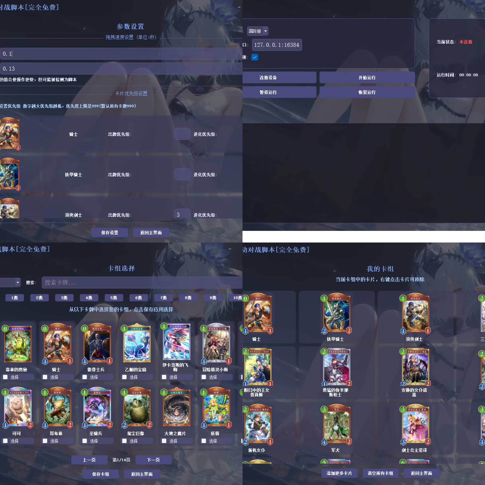
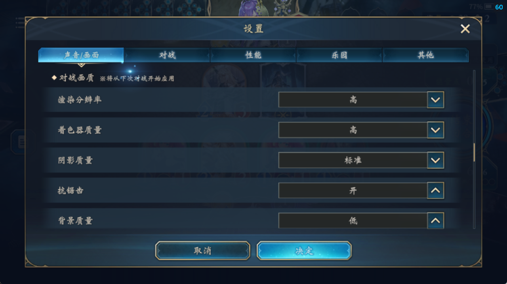
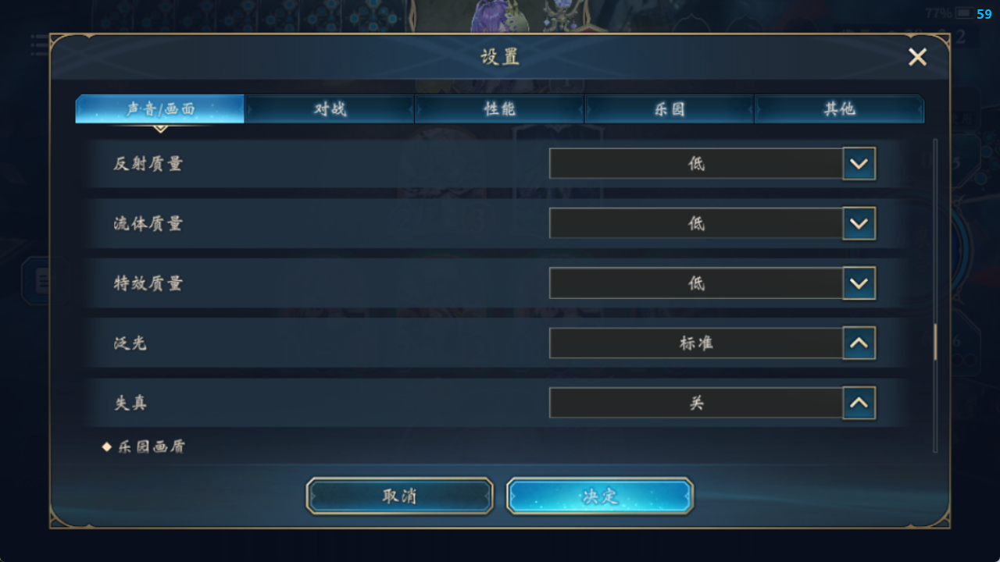

# Shadowverse-Wb-Auto-UI
影之诗超凡世界-自动挂机脚本-UI版
  
## 主要功能
1.自动进行影之诗对战  
2.支持国服和国际服  
3.可配置的卡组优先级系统  
4.可进行拖拽参数设置  
5.详细的运行统计和日志  
6.卡组管理和分享功能  

## 使用前说明  

1.使用1280x720分辨率   
2.用黑色背景的场地（不要用简易，识别出错率会剧增） 不知道是哪个场地的，去看一下压缩包里面的“场景选择.JPG”  
3.画面设置请看压缩包里面的 “对战画质1”和“对战画质2”  
3.脚本卡组选择请和你的游戏卡组保持同步，“保存卡组”后， #你的游戏用的什么卡组你的脚本也要选择同意的卡组，包括衍生物  
4.卡组的分享应用，可以用别人的分享码来进行适配，应用之后可以不再管”卡组选择“和”参数设置“  
  直接开始即可， 自己设置好卡组和参数之后，也可以生成分享码给其他人用  
5. 服务器选择，可选国际服和国服。深色识别，只有国际服有深色BUG的用户才需要开启  
  
  
  

## UI版使用  

### 主界面功能：
连接设备  
开始/暂停/恢复脚本  
管理卡组和配置  
卡组管理：  
在"卡组选择"页面选择需要的卡牌  
在"参数设置"页面配置卡牌优先级  
使用"卡组分享"功能导入/导出卡组配置  

# 原项目地址
https://github.com/Sagisawa/auto_szb  
感谢作者码源提供
